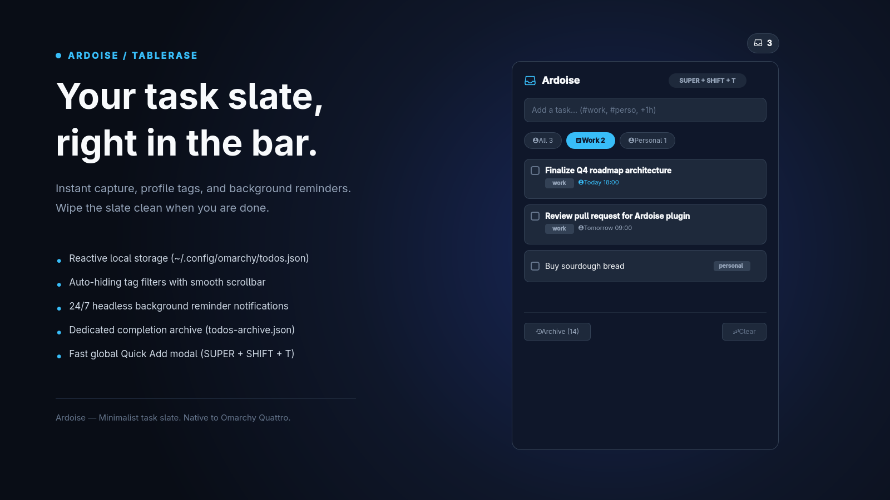

# Ardoise — Minimalist Task Slate for Omarchy

<p align="center">
  
</p>

A productivity status bar widget, flyout panel, quick-add modal, and background reminder service for **Omarchy Quattro (Omarchy 4.x)**, built with Quickshell and QtQuick.

---

## Features

- **Live Bar Widget**:
  - Displays a stateful task-slate mark that escalates with urgency, plus the pending task count badge (`ArdoiseIcon <count>`).
  - Interactive tooltip with profile breakdown: `󰍽 [L] Panel   󰍽 [R] Quick Add   󰍽 [M] Edit`.
  - Middle-click directly opens `todos.json` in your default editor via `omarchy-launch-editor`.
- **Profiles & Categories**:
  - Built-in `personal` and `work` profiles, with support for custom profiles (`#project1`, `#shopping`, etc.).
  - **Zero-Clutter Auto-Hiding**: Profiles with zero active/pending tasks automatically hide from the filter bar, keeping your workspace clean.
  - **Tag Aliasing**: `#perso` and `#personal` are unified into the canonical `personal` tag.
  - **Flexible Hashtag Syntax**: Typing `#work Deploy release` or `# work Deploy release` automatically categorizes the task to `work`.
  - **Horizontal Wheel Scrolling**: Scroll the mouse wheel (or touchpad two-finger scroll) over the pills to scroll horizontally.
  - **Ultra-Thin Scrollbar**: 2px sleek native horizontal scrollbar appears when profiles overflow.
  - **Soft Blur/Fade Edges**: Gradient fade edges smoothly blend overflowed pills into the card background before the pinned `+` button.
  - Create new profiles directly from the panel UI or Quick Add.
- **Notes & Descriptions**:
  - Optional multiline descriptions and notes per task.
  - **Expandable Task Rows (`󰅀` / `󰅃`)**: Click the chevron on any task to view/edit notes, set quick reminders, or reassign profiles in place.
  - Notes indicator icon (`󰏫`) displays when a collapsed task contains a description.
- **Full Title Hover Tooltip**:
  - When a task title exceeds the available row width, hovering over the truncated text displays the complete title via Omarchy's themed `PanelToolTip`.
- **Configurable Reminders & Background Service**:
  - Scheduled timestamps with quick presets (`+30m`, `+1h`, `Tomorrow 9am`, `Tomorrow 6pm`).
  - Headless background service (`Service.qml`) running 24/7 in the Omarchy Quattro shell.
  - Native desktop notifications via `omarchy-notification-send` with direct click-to-open actions (`--exec omarchy-shell shell toggle tablerase.ardoise "{}"`).
- **Keyboard-First Task Capture (Quick Add)**:
  - Summon from anywhere via global hotkey (`SUPER + SHIFT + T`).
  - 1-second capture: type task and hit `Enter` to add instantly.
  - Optional expandable note and reminder preset selector.
- **Cloud & AI-Ready Reactive Storage**:
  - Pure Schema v1 in `~/.config/omarchy/todos.json`.
  - Zero-latency inotify updates (`FileView` with `watchChanges: true`) — sync via Git, Nextcloud, Syncthing, or write via AI agents and CLI scripts.
- **Shell IPC Integration**:
  - Full IPC interface for scripting and AI assistants.

---

## Data Schema (Version 1)

Stored at `~/.config/omarchy/todos.json`:

```json
{
  "version": 1,
  "activeProfile": "personal",
  "profiles": [
    "personal",
    "work"
  ],
  "todos": [
    {
      "id": 1789992760433,
      "title": "Fix database query performance",
      "description": "Index the user_id column on orders table",
      "profile": "work",
      "done": false,
      "createdAt": 1789992760433,
      "dueDate": null,
      "reminder": "2026-09-22T09:00:00.000Z",
      "notified": false
    }
  ]
}
```

### Schema Properties

| Field | Type | Description |
| :--- | :--- | :--- |
| `version` | `number` | Schema version (`1`). |
| `activeProfile` | `string` | Currently active default profile (`"personal"`). |
| `profiles` | `string[]` | Registered list of profiles. |
| `todos[].id` | `number` | Unique task identifier (timestamp). |
| `todos[].title` | `string` | Task title text. |
| `todos[].description` | `string` | Optional details, notes, or instructions. |
| `todos[].profile` | `string` | Profile / category tag (`personal`, `work`, custom). |
| `todos[].done` | `boolean` | Completion state (`true` or `false`). |
| `todos[].createdAt` | `number` | Creation timestamp in epoch milliseconds. |
| `todos[].dueDate` | `string\|null` | Optional due date ISO 8601 string. |
| `todos[].reminder` | `string\|null` | Scheduled reminder ISO 8601 string. |
| `todos[].notified` | `boolean` | Whether desktop notification has been fired. |

---

## Archive Schema (`todos-archive.json`)

Stored at `~/.config/omarchy/todos-archive.json`. When tasks are marked as done and cleared, they are moved to this dedicated archive with completion timestamps for productivity tracking and analytics:

```json
{
  "version": 1,
  "archived": [
    {
      "id": 1789992760433,
      "title": "Fix database query performance",
      "description": "Index the user_id column on orders table",
      "profile": "work",
      "createdAt": 1789992760433,
      "completedAt": 1789999999999
    }
  ]
}
```

### Archive Properties

| Field | Type | Description |
| :--- | :--- | :--- |
| `version` | `number` | Archive schema version (`1`). |
| `archived[].id` | `number` | Original task identifier. |
| `archived[].title` | `string` | Task title. |
| `archived[].description` | `string` | Task notes or description. |
| `archived[].profile` | `string` | Tag/profile when completed. |
| `archived[].createdAt` | `number` | Epoch millisecond timestamp when task was created. |
| `archived[].completedAt` | `number` | Epoch millisecond timestamp when task was cleared/archived. |

---

## Shell IPC Reference

You can control and query the todo plugin directly from terminal commands, shell scripts, or AI agents:

```bash
# Get pending task count
omarchy-shell tablerase.ardoise count

# List all tasks in JSON format
omarchy-shell tablerase.ardoise list

# Get list of registered profiles in JSON format
omarchy-shell tablerase.ardoise profiles

# Add a new task (supports #tags and # space tags)
omarchy-shell tablerase.ardoise add "Review PR #work"
omarchy-shell tablerase.ardoise add "Buy groceries #personal"

# Switch active profile
omarchy-shell tablerase.ardoise setProfile "work"

# Toggle the task list flyout panel
omarchy-shell tablerase.ardoise toggle

# Open or close the panel explicitly
omarchy-shell tablerase.ardoise open
omarchy-shell tablerase.ardoise close

# Clear all completed tasks and move them to archive
omarchy-shell tablerase.ardoise clear

# View all archived completed tasks in JSON format
omarchy-shell tablerase.ardoise archived

# Get total count of archived completed tasks
omarchy-shell tablerase.ardoise archiveCount
```

### Scripting & AI Integration Examples

Filter pending work tasks using `jq`:
```bash
omarchy-shell tablerase.ardoise list | jq '[.[] | select(.done == false and .profile == "work")]'
```

Add tasks directly via CLI or agy skill:
```bash
omarchy-shell tablerase.ardoise add "#project1 Implement user authentication"
```

Because the plugin monitors `~/.config/omarchy/todos.json` with inotify (`watchChanges: true`), external programs, git hooks, and synchronization clients (Nextcloud, Syncthing) can write directly to the JSON file, and changes will reflect across the bar widget and panel in real-time.

---

## Desktop Shortcuts (Panel & Quick Add)

Summon the dropdown task panel or the Quick Add modal anywhere on your desktop:

### Hyprland Keybinding Configuration

**Omarchy Quattro (Omarchy 4.x / Lua):**
Add to `~/.config/hypr/bindings.lua`:
```lua
o.bind("SUPER + ALT + T", "Ardoise Panel Toggle", "omarchy-shell tablerase.ardoise toggle")
o.bind("SUPER + SHIFT + T", "Ardoise Quick Add", "omarchy-shell shell toggle tablerase.ardoise '{}'")
```

**Classic Omarchy (Omarchy 3.x / Conf):**
Add to `~/.config/hypr/bindings.conf`:
```ini
bindd = SUPER ALT, T, Ardoise Panel Toggle, exec, omarchy-shell tablerase.ardoise toggle
bindd = SUPER SHIFT, T, Ardoise Quick Add, exec, omarchy-shell shell toggle tablerase.ardoise "{}"
```

Then reload Hyprland:
```bash
hyprctl reload
```

> **Tip:** In the Todos panel header, click the keyboard icon button (`󰌌`) to automatically copy both binding snippets to your clipboard and open the config file in your editor.
> - `✓` **Green**: Both shortcuts are active and detected in Hyprland.
> - `!` **Orange**: 1 of 2 shortcuts is active, or bindings are commented out in your config file.
> - `✕` **Red**: Shortcuts are unconfigured.

### Bar Mouse Shortcuts
- **󰍽 [L] Left Click**: Toggles the task list flyout panel.
- **󰍽 [R] Right Click**: Directly summons the Quick Add modal.
- **󰍽 [M] Middle Click**: Opens `~/.config/omarchy/todos.json` in your default terminal editor via `omarchy-launch-editor`.

---

## Background Reminder Service

The plugin includes a headless service (`Service.qml`) declared with kind `"service"` in [`manifest.json`](manifest.json).

- **Lifecycle**: Loaded automatically by `shell.qml` when Omarchy starts and runs 24/7.
- **Monitoring**: Inspects `todos.json` every 15 seconds for uncompleted tasks with `reminder <= now` and `notified == false`.
- **Notification**: Calls `/usr/share/omarchy/bin/omarchy-notification-send`:
  - Glyph: `󰥔` (reminder clock).
  - Headline: Task title.
  - Body: Profile tag and description notes.
  - Click Action: Clicking the desktop notification triggers `omarchy-shell shell toggle tablerase.ardoise "{}"` to open the task panel.
- **State Update**: Marks `notified: true` and writes back atomically to prevent duplicate alerts.

---

## Local Development & Installation

### 1. Link Plugin to Omarchy

```bash
mkdir -p "$HOME/.config/omarchy/plugins"
ln -s "$(pwd)" "$HOME/.config/omarchy/plugins/tablerase.ardoise"
```

### 2. Rescan and Enable

```bash
# Tell Omarchy shell to discover the plugin
omarchy-shell shell rescanPlugins

# Enable on the bar
omarchy plugin enable tablerase.ardoise right
```

### 3. Move or Reorder (Optional)

```bash
# Position widget in the center or left section
omarchy bar move tablerase.ardoise center 0
```

### 4. Verify Code Quality & Run Tests

#### A. Fast Local Development (No Docker Required)

Run tests and linters directly on your machine without spinning up containers:

```bash
# Complete local verification suite
npm run check

# Or run individual targets:
npm test            # 33 automated tests (TodoStore logic + QML static analysis & runtime lifecycle)
npm run test:deno   # Run test suite via Deno test runner
npm run typecheck   # Static typecheck TodoStore.js via TypeScript
npm run lint:qml    # Lint all QML files with qmllint
npm run validate:plugin # Validate Omarchy Quattro plugin manifest & schema
```

#### B. Test GitHub Actions Locally (`gh act`)

To test the exact GitHub Actions CI runner locally before pushing, use [`act`](https://github.com/nektos/act) via the official GitHub CLI extension:

1. **Install the extension once:**
   ```bash
   gh extension install nektos/gh-act
   ```

2. **Run the CI test workflow locally:**
   ```bash
   npm run test:ci
   # Or directly:
   gh act -j test -P ubuntu-latest=node:20-bookworm-slim
   ```
   > **Note on Security:** We configure `node:20-bookworm-slim` (official Docker Hub image from the Node.js Foundation) as the host bootstrap runner. The test steps execute inside the official `archlinux:latest` container as defined in `.github/workflows/ci.yml`.

#### C. Clean Containerized Run via Docker (Zero extra tools)

If you prefer testing the pristine Arch Linux CI environment directly without installing `act`:

```bash
npm run test:docker
```

### 5. Restart Shell (After Modifying Service)

```bash
omarchy-restart-shell
```

---

## Project Structure

```text
.
├── manifest.json         # Plugin manifest (kinds: ["bar-widget", "overlay", "service"])
├── package.json          # Test runner & validation scripts
├── tsconfig.json         # TypeScript compiler & IDE configuration
├── BarWidget.qml         # Bar readout, mouse gestures, IPC handler, and panel loader
├── Panel.qml             # Wayland layer-shell KeyboardPanel wrapper
├── PanelContent.qml      # Reusable task slate UI with profile filters, scrollbar, and task rows
├── QuickAdd.qml          # Fullscreen overlay modal for rapid keyboard capture
├── Service.qml           # Headless background service monitoring scheduled reminders
├── TodoStore.js          # Fully-typed data store, Schema v1 normalization, and archive logic
├── ui/                   # Modular component library shared by the panel and modals
│   ├── ArdoiseIcon.qml   # Stateful task-slate brand mark (Nerd Font MD ladder rung, optically centred)
│   ├── Chip.qml          # Compact pill/badge for reminders, repos, tags, locations
│   ├── GitModal.qml      # Git snapshot review, rollback, and remote sync modal
│   ├── HelpModal.qml     # Searchable keyboard shortcut directory
│   ├── KeyBadge.qml      # Keyboard shortcut key badge
│   ├── ProfileSelector.qml # Horizontal scrollable profile pill row
│   ├── ReminderPills.qml  # Horizontal scrollable reminder preset row
│   ├── ShortcutToolTip.qml # Action description + shortcut badges tooltip
│   └── TaskCheck.qml     # Circular checkbox / urgency indicator button
├── preview.png           # 1600x900 marketplace artwork & preview banner
├── screenshots/          # High-resolution screenshots for documentation
│   └── panel.png         # Flyout task panel screenshot
├── tools/                # Development & asset generation tools
│   ├── preview.qml       # Offscreen QML render definition
│   └── render-preview.sh # Automated Quickshell headless capture script
├── tests/                # Unit & runtime test suite
│   ├── TodoStore.test.mts # Data store, schema normalization, and profile sorting tests
│   └── qml-runtime.test.mts # Headless Quickshell lifecycle, motion regressions, & shell IPC tests
├── DESIGN.md             # UI & interaction design specification (layout hierarchy, motions, tokens)
├── AGENTS.md             # AI model & developer guidelines and maintenance contract
└── README.md             # Documentation and API reference
```

---

## Acknowledgments & Inspiration

- **[OmaTasks for Todoist](https://github.com/crmne/omatasks)** by **Carmine Paolino** ([@crmne](https://github.com/crmne)) (MIT License):
  - Canvas 2D vector inbox icon architecture.
  - Multi-kind overlay pattern for fullscreen keyboard-first Quick Add modal.
  - Headless Quickshell offscreen preview rendering and banner generation pipeline (`tools/render-preview`).
- **[Planova / PlaneTxt](https://github.com/brvier/PlanovaQuickShell)** by **Benoît HERVIER** ([@brvier](https://github.com/brvier)):
  - Separation of reactive data stores from visual UI presentation.
- **[Omarchy](https://github.com/omacom/omarchy)**:
  - For the Quickshell bar widget architecture, theme tokens, and desktop environment.
